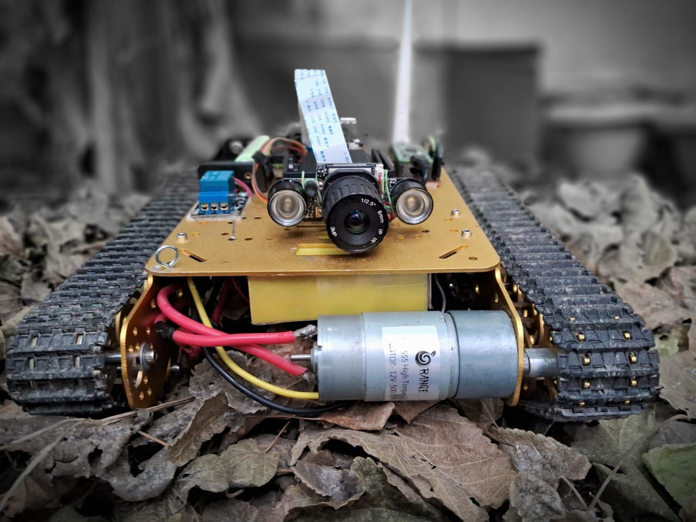

# ARANYANI Mark 1 - Robot Control Code



[]()
[](LICENSE)
[]()


The ARANYANI Mark 1 is a robot control code developed by Shourya Maker Lab. This code is designed to control the fundamental movements of the ARANYANI Mark 1 robot, which is equipped with various components, including a computerized R/C remote controller, an FS-R6B receiver system, an MD 10C motor driver by Cytron, and servo motors. It allows you to control the robot using a remote controller, enabling it to perform various movements and actions.

For more information about the name "Aranyani," please visit [this link](https://en.wikipedia.org/wiki/Aranyani).

**अरण्यनी मार्क 1 गर्व से भारत में निर्मित | Aranyani Mark 1 proudly made in Bharat.**

## Parts Needed


|Serial Number| Product         | Supplier/Link                         | 
| ----------- | --------------- | ------------------------------------- | 
|01| Waveshare Camera| https://robu.in/product/waveshare-rpi-ir-cut-camera-b-better-image-in-both-day-and-night/ | 
|02| Servo Mount Brackets | https://robu.in/product/servo-mount-brackets-for-mg995-mg996-servo-motor/  | $2.69|
|03| Servo (360°)| https://robu.in/product/towerpro-mg995-continuous-rotation-360-metal-gear-servo-motor-9-2kg/ | $3.95  |
|04| Servo (180°) | https://robu.in/product/towerpro-mg995-metal-gear-servo-motor/  | $3.12 |
|05| Rpi case|https://robu.in/product/aluminum-heat-sink-case-with-double-fans-for-raspberry-pi-4b-black/ | $10.79  |
|06| Motor driver x2pieces |https://robu.in/product/enhanced-13amp-dc-motor-driver-30a-peak-10-seconds/  | $28.62 |
|07| Battery | https://robu.in/product/orange-5200mah-4s-40c-lithium-polymer-battery-pack-lipo/ | $65.03  |
|08| Battery charger| https://robu.in/product/imax-b6ac-v2-professional-balance-chargerdischarger/  | $57.56 |
|09| Lipo battery connector x2pieces |https://robu.in/product/xt60h-connector-with-housing-male/ | $0.96 |
|10| Remote controler| https://robu.in/product/flysky-fs-t6-6ch-transmitter-with-fs-r6b-receiver/ | $67.40  |
|11| AAA rechargeable battery x2pack | https://robu.in/product/panasonic-eneloop-aaa-bk-4mcce-2bn-rechargeable-battery-pack-of-4/ | $19.64 |
|12| AAA rechargeable battery charger |https://robu.in/product/panasonic-bq-cc55n-eneloop-smart-and-quick-charger-for-ni-mh-battery-cell/ | $18.40  |
|13| Arduino uno mini Board|https://robu.in/product/arduino-uno-mini-limited-edition/|$46.25|
|14| Chassis| https://thinkrobotics.in/products/shock-absorption-metal-robot-tank-chassis?variant=16420917870664 | $175.55  |
|15| Raspberry pi 4 | https://rees52.com/product/3911-raspberry-pi-4-model-b-with-1gb-2gb-4gb-lpddr4-sdram-rs2237#/36-ram-8_gb  | $161.99 |
|16| 3d printer | https://www.amazon.in/gp/product/B07BR3F9N6/ref=ewc_pr_img_1?smid=AH017Z3M1ZJ3T&th=1 | $177.32  |
|17| 3d printer filament white  | https://www.amazon.in/gp/product/B06Y35GHT8/ref=ewc_pr_img_3?smid=A265UAHVFOFJA3&th=1  | $10.42 |
|18| 3d printer filament black |https://www.amazon.in/gp/product/B08ZHN584T/ref=ewc_pr_img_4?smid=A3MCB9NUD1CPCV&th=1 | $12.21 |
|19| 3.5inch display for pi | https://robu.in/product/3-5-touch-screen-lcd-raspberry-pi/  | $14.35 |
|20| Motors | https://robu.in/product/orange-12v-og555-500rpm-dc-motor-for-diy-projects-grade-a-quality/ | $12.92 |
|21| Raspberry Pi Pico |https://robu.in/product/raspberry-pi-pico/ | $12.92 |


## Code Version

- Current Code Version: 1.2.1

## Features

- Receives PWM signals from an FS-R6B receiver.
- Processes signals for motor control using the MD 10C motor driver.
- Compatible with the Arduino Mega 2560.
- Compatible with the Raspberry Pi Pico.

## Installation

1. Clone the repository to your local machine:
   ```bash
   git clone https://github.com/yourusername/aranyani-mark-1.git
   ```

2. Open the code in the Arduino IDE.

3. Ensure you have the required dependencies, including the Arduino libraries for servo motors and motor drivers.

4. Connect the ARANYANI Mark 1 hardware components to your Arduino board.

5. Upload the code to your Arduino board.

## Usage

1. Connect the FS-R6B receiver system and the motor driver to your robot's control board.

2. Power on the robot and ensure that the receiver system is paired with the remote controller.

3. Use the remote controller to send commands to the robot.

4. The code will process the received signals and control the motors and servo motors accordingly.

5. Monitor the robot's movements and actions through the serial monitor for troubleshooting and testing.

## Wiring Diagram

You can find a wiring diagram in the `DOCUMENTATION.md` directory of this repository.

# Change Log

All notable changes to the "ARANYANI Mark 1 - Robot Control Code" will be documented in this file.

The format is based on [Keep a Changelog](https://keepachangelog.com/en/1.0.0/),
and this project adheres to [Semantic Versioning](https://semver.org/spec/v2.0.0.html).

## [1.2.0] - 2023-10-29

### Added

- Feature: Implemented new control mode for improved maneuverability.
- Documentation: Added detailed setup instructions for first-time users.
- Compatible with the Raspberry Pi Pico.
- Added a relay feature to control lights of the rover.
- Led blinking for troubleshooting

### Changed

- Performance: Optimized motor control for smoother operation.
- Refactor: Reorganized code for improved readability.
- Dependencies: Updated dependencies to their latest versions.

### Fixed

- Bug: Resolved issue with remote control signals not being processed correctly.
- Bug: Fixed a compatibility issue with certain motor drivers.

## [1.0.1] - 2023-02-26

### Fixed

- Bug: Fixed an issue where a delay function caused signal transfer delays.

## [1.0.0] - 2023-02-20

### Added

- Initial release of the ARANYANI Mark 1 robot control code.


## License

[](https://opensource.org/licenses/MIT)


## Acknowledgments

Special thanks to Shourya Maker Lab for their contribution to this project.

---

**Note:** Please refer to the official documentation and instructions provided by Shourya Maker Lab for any specific hardware setup and additional information.

For more information and support, contact Shourya Maker Lab at [shouryamakerlab@gmail.com](mailto:shouryamakerlab@gmail.com).


